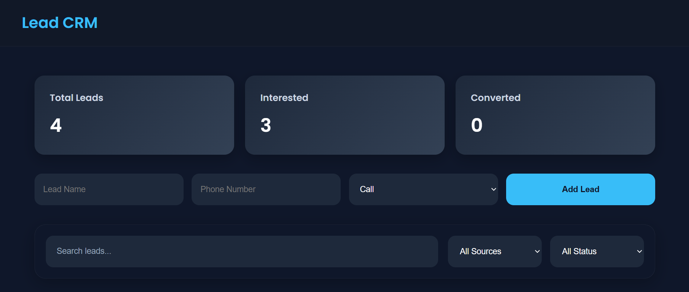
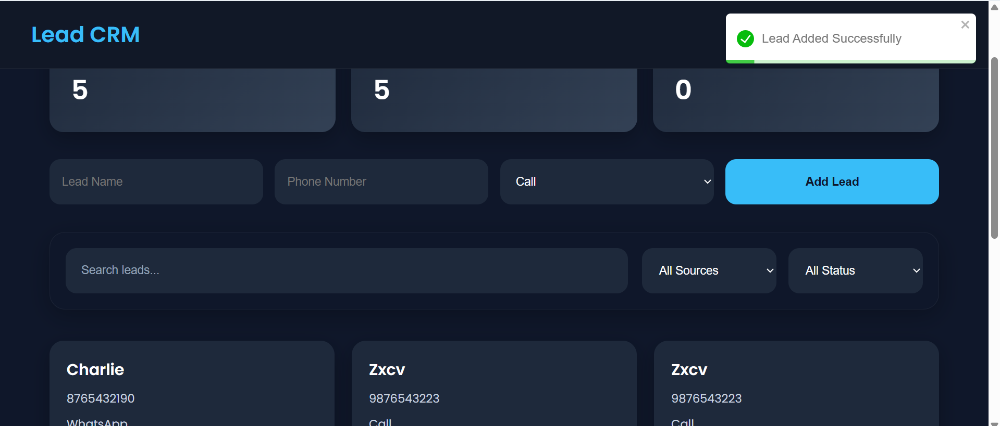
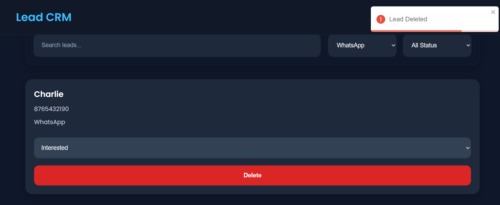
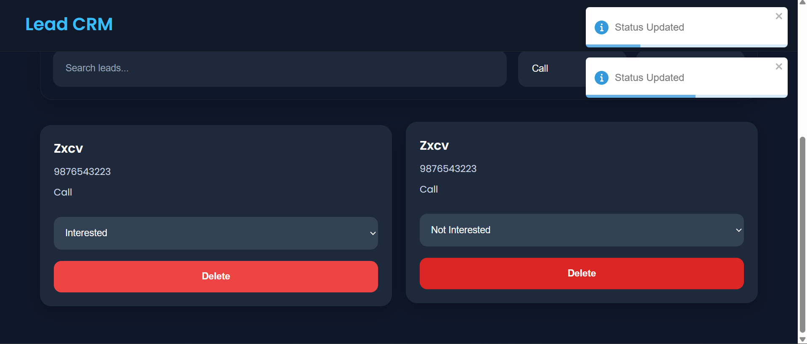

# 🚀 Lead Management System (Mini CRM)

A full-stack Lead Management CRM application built using:

- React.js
- Node.js
- Express.js
- PostgreSQL

This project allows users to:
- Add leads
- Search leads
- Filter leads
- Update lead status
- Delete leads
- Track lead statistics

---

# ✨ Features

## Frontend
- Premium responsive UI
- Dashboard cards
- Search functionality
- Filter by source
- Filter by status
- Toast notifications
- Responsive design

## Backend
- REST APIs
- Proper folder structure
- PostgreSQL integration
- CRUD operations
- Error handling

## Database
- PostgreSQL database
- Lead management table
- Persistent storage

---

# 🛠️ Tech Stack

## Frontend
- React.js
- Axios
- React Toastify
- CSS3

## Backend
- Node.js
- Express.js
- PostgreSQL
- dotenv
- cors

## Database
- PostgreSQL

---

# 📂 Project Structure

```bash
lead-management-system/
│
├── backend/
│
├── frontend/
│
└── README.md
```

---

# ⚙️ Installation & Setup

## 1️⃣ Clone Repository

```bash
git clone YOUR_GITHUB_REPO_LINK
```

---

# Backend Setup

## Go to backend folder

```bash
cd backend
```

## Install dependencies

```bash
npm install
```

## Create .env file

```env
PORT=5000

DB_USER=postgres
DB_PASSWORD=your_password
DB_HOST=localhost
DB_PORT=5432
DB_NAME=lead_management
```

## Run backend

```bash
npm run dev
```

Server runs on:

```bash
http://localhost:5000
```

---

# Frontend Setup

## Go to frontend folder

```bash
cd frontend
```

## Install dependencies

```bash
npm install
```

## Run frontend

```bash
npm start
```

Frontend runs on:

```bash
http://localhost:3000
```

---

# 📌 API Endpoints

| Method | Endpoint | Description |
|---|---|---|
| GET | /api/leads | Get all leads |
| POST | /api/leads | Add new lead |
| PUT | /api/leads/:id | Update lead status |
| DELETE | /api/leads/:id | Delete lead |

---

# 🎯 Lead Status Options

- Interested
- Not Interested
- Converted

---

# 📞 Lead Source Options

- Call
- WhatsApp
- Field

---

# 📷 Screenshots

## Dashboard



---

## Lead Card 1



---

## Lead Card 2



---

## Lead Card 3



---

# 🌐 Deployment

## Frontend
Deployed on Vercel

## Backend
Deployed on Render

## Database
Hosted on Neon PostgreSQL

---

# 👨‍💻 Author

Your Name

---

# ⭐ Future Improvements

- Authentication
- Pagination
- Dark/Light mode
- Charts & analytics
- Export leads to Excel
- Role-based access